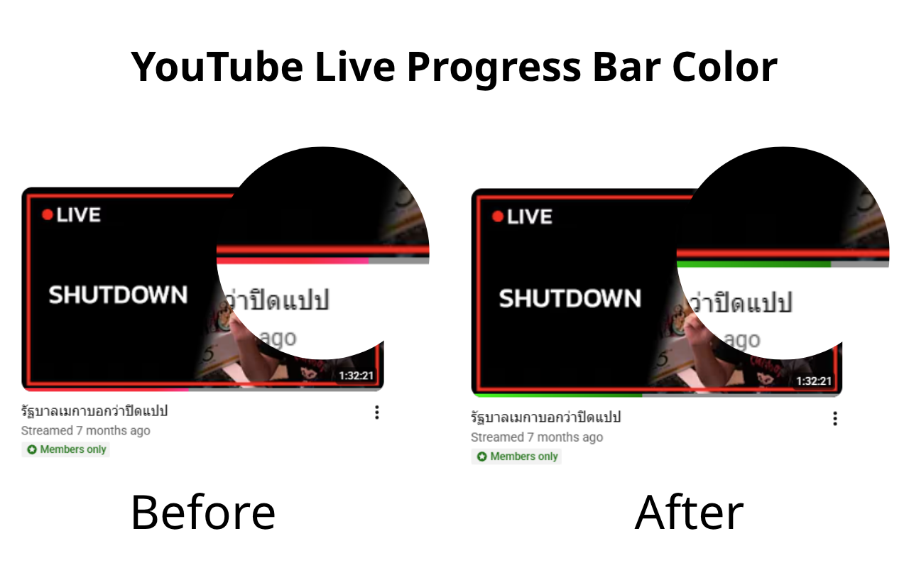

# YouTube Live Progress Bar Color

ส่วนขยายสำหรับ Google Chrome และสคริปต์สำหรับ Tampermonkey ที่จะเปลี่ยนสีแถบความคืบหน้า (Progress Bar) ของวิดีโอที่ดูแล้วในหน้า "Streams" ของ YouTube ให้เป็นสีที่คุณต้องการ

## การดาวน์โหลดและติดตั้ง
เลือกติดตั้งตามรูปแบบที่คุณสะดวก:

### 1. รูปแบบ Chrome Extension (แนะนำ)
- **ดาวน์โหลด:** [คลิกที่นี่เพื่อดาวน์โหลดส่วนขยาย](https://example.com/download-extension)
- **วิธีติดตั้ง:**
  1. กดเพิ่มใน Chrome

### 2. รูปแบบ Tampermonkey Script
- **ดาวน์โหลด:** [คลิกที่นี่เพื่อติดตั้งสคริปต์](https://raw.githubusercontent.com/kon3ko/yt-watch-bar/youtube-live-progress-bar-color.user.js)
- **ความต้องการ:** ต้องติดตั้งส่วนขยาย Tampermonkey ในเบราว์เซอร์ก่อน

## คุณสมบัติ
- รองรับทั้งการใช้งานเป็น **Chrome Extension (Manifest V3)** และ **Tampermonkey UserScript**
- เปลี่ยนสีแถบวิดีโอที่ดูแล้ว (Watched Progress Bar) ในหน้าหมวด Streams ของช่อง YouTube
- สำหรับเวอร์ชัน Extension: สามารถปรับแต่งสีได้เองผ่านหน้า **Options** (รองรับทั้ง Hex Color และ CSS Gradient)
- ทำงานแบบ Real-time เปลี่ยนสีปุ๊บ เห็นผลปั๊บไม่ต้องรีเฟรชหน้าเว็บ

## วิธีปรับแต่งสี (เฉพาะเวอร์ชัน Extension)
1. คลิกขวาที่ไอคอน Extension บนแถบเครื่องมือ หรือไปที่หน้าจัดการส่วนขยาย
2. เลือก **Options** (ตัวเลือก)
3. ระบุสีที่ต้องการในช่อง "Progress Bar Color" เช่น:
   - สีพื้นฐาน: `#ff0000` (สีแดง), `blue`, `rgb(0, 255, 0)`
   - สีไล่ระดับ: `linear-gradient(90deg, #00ff00 0%, #008000 100%)`
4. กดปุ่ม **Save Settings**

## ผู้เขียน
- **Author:** kon3ko
- **GitHub:** [https://github.com/kon3ko/yt-watch-bar](https://github.com/kon3ko/yt-watch-bar)

## ใบอนุญาต (License)
[MIT License](LICENSE)
